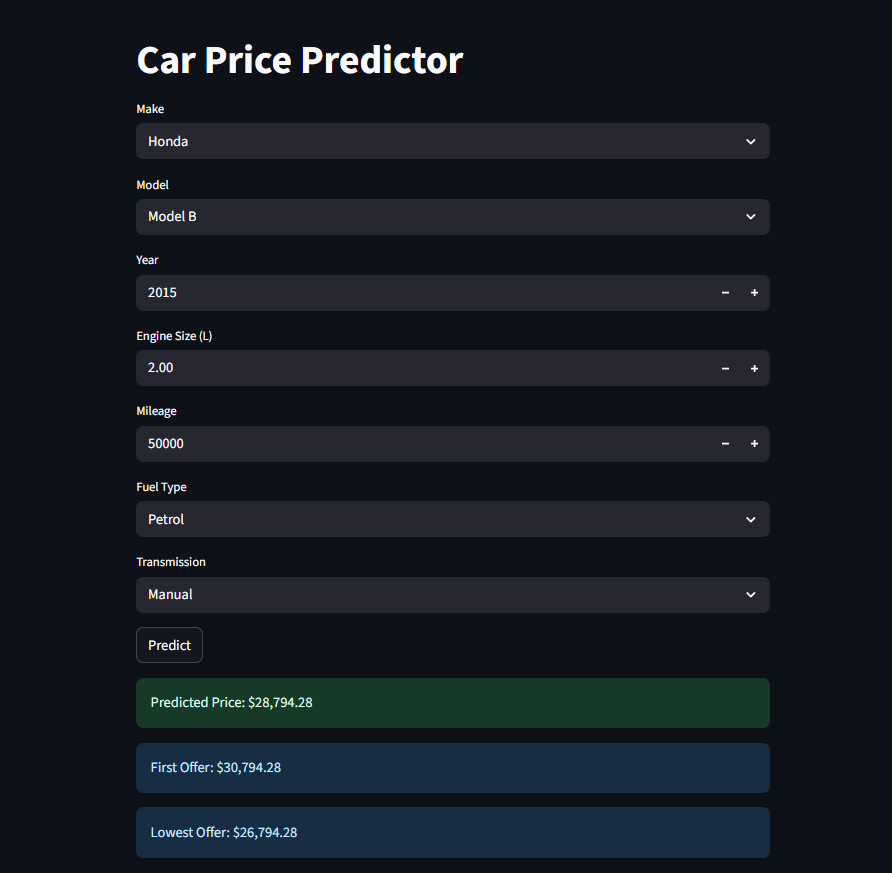

# Car Price Prediction App

A machine learning web application developed for a fictional business that predicts prices based on various vehicle attributes.

## Overview
Used car pricing often varies significantly due to largely subjective value placed on different attributes.

This app uses a regression-based machine learning model to provide objective price predictions, determined from historical data.

## Tech Stack
- Python
- Pandas
- NumPy
- Scikit-learn
- Streamlit

## Features
- Interactive Streamlit UI for live predictions
- Parameter modification for prediction adjustment

## How to Run
1. Clone the repository:
```
git clone https://github.com/SirPlasmaDuck/car-price-predictor.git
```
2. Navigate into the project folder:
```
cd car-price-predictor
```
3. Install dependencies:
```
pip install -r requirements.txt
```
4. Run the app:
```
streamlit run car_price_app.py
```

## Demo


## Author
Richard Hamilton